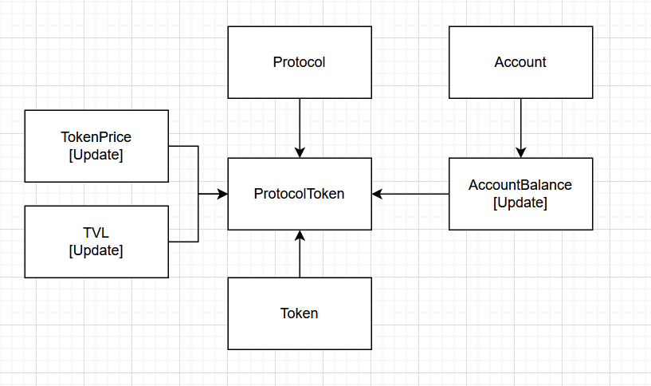

# Install

Clone the repository

    git clone git@github.com:kostorub/db-perfomance-test.git
    cd db-perfomance-test

Start a docker container for the Postgresql service

    docker-compose -f docker-compose/postgresql.yaml up

Use either CPython interpreter or PyPy for the best perfomance

    python3 -m venv .venv_cpython
    . ./.venv_cpython/bin/activate
    pip install pip-tools
    pip-compile
    pip-sync

For basic benchmarks use

    python3 ./src/api.py

On my machine I have

    Timeitit <get_protocol_estimation>: 0.01793503761291504 sec
    Timeitit <get_portfolio_timeline>: 0.06346869468688965 sec # Period.HOUR
    Timeitit <get_portfolio_timeline>: 0.07407307624816895 sec # Period.DAY
    Timeitit <get_portfolio_timeline>: 0.04651594161987305 sec # Period.MONTH
    Timeitit <get_top_accounts>: 171.3708782196045 sec

# Architecture 

# Current view

# Alternative view